# rich-search

> A rich search custom element `<rich-search>` with keyword-based autocomplete and live syntax highlighting powered by the **OpaqueRange API** and **CSS Custom Highlight API**.

[](LICENSE)
[](https://developer.mozilla.org/en-US/docs/Web/API/Web_components/Using_custom_elements)

The `<rich-search>` component acts like a standard `<input type="text">` so users can type ordinary text or search terms, but enhances it with contextual autocomplete and in-input syntax highlighting for structured `keyword:value` searches (such as `label:"We Play House Recordings" year:2026 playlist:"WPH Classics"`).

---

## Features

- **Standard Input Ergonomics**: Acts and feels like a regular `<input type="text">` with standard value access, selection ranges, and events.
- **Dual Contextual Autocomplete**:
  - **Keywords**: Typing at the start of a token (e.g. typing `a`) suggests configured keywords like `artist:` and `style:`.
  - **Values**: Typing within a keyword value (e.g. `label:"K` or `label:K`) suggests matching options like `"Keinemusik"` and `"Kranky"`.
- **Range-Based Positioning via OpaqueRange**: Positions autocomplete dropdown popovers anchored to the start of the active `OpaqueRange` (e.g. at the opening quotation mark of a value) using `range.getBoundingClientRect()`, rather than shifting with the cursor.
- **Native In-Input Highlighting via CSS Custom Highlight API**: Highlights keyword values inside the `<input>` control using standard CSS rules like `::highlight(label)` or `::highlight(year)` without brittle mirror-div overlays.
- **Declarative Configuration via `<datalist>`**: Configure keywords and options purely in HTML by nesting standard `<datalist>` elements with `<option>` tags inside `<rich-search>`.
- **Rich Option Markup**: Embed custom HTML markup (such as logos, images, icons, and avatars) directly inside `<option>` elements for rich, visual suggestion popovers.
- **Form Associated**: Implements `static formAssociated = true` and `ElementInternals` to participate seamlessly in `<form>` submission, `FormData`, and form reset lifecycles.
- **Shadow Parts Theming (`::part`)**: Full CSS customizability using `::part(input)`, `::part(control)`, `::part(popover)`, `::part(suggestion-item)`, etc.
- **Accessible (W3C Combobox Pattern)**: ARIA 1.2 compliant combobox with keyboard navigation (`ArrowUp`, `ArrowDown`, `Enter`, `Tab`, `Escape`), `aria-expanded`, and `aria-activedescendant`.
- **Graceful Fallback**: Automatically feature-detects `createValueRange` and gracefully falls back to control-aligned popovers in environments without OpaqueRange.

---

## Component Anatomy & Shadow Parts

The visual below illustrates the internal Shadow DOM elements, exposed CSS Shadow Parts (`::part`), and CSS Custom Highlight pseudo-elements (`::highlight`), showing how they relate to one another:

<p align="center">
   Component Anatomy, Shadow Parts, and Highlight Pseudos" width="100%">
</p>

- `<rich-search>`: The host custom element wrapping the control, datalists, and suggestions popover.
- `::part(control)`: The outer input container enclosing the icon, input, and clear button.
- `::part(icon)`: The leading search magnifying glass SVG icon.
- `::part(input)`: The native `<input type="text">` where users type.
- `::highlight(<keyword>)`: Target pseudo-element for styling keyword values via the CSS Custom Highlight API (e.g. `::highlight(label)`, `::highlight(year)`).
- `::part(clear-button)`: The clear button (visible when text is present).
- `::part(popover)`: The autocomplete dropdown popover container anchored to the start of the active range via `OpaqueRange`.
- `::part(suggestions-header)`: The header bar at the top of the suggestions popover.
- `::part(suggestions-list)`: The `<ul>` container holding autocomplete suggestion items.
- `::part(suggestion-item)`: Each suggestion `<li>` row.
- `::part(suggestion-item-active)`: The currently selected / keyboard-focused suggestion row.
- `::part(suggestion-keyword)`: The keyword label text inside a keyword suggestion.
- `::part(suggestion-value)`: The value label text inside a value suggestion.

---

## Quick Start

### 1. Installation

Install via npm:

```bash
npm install rich-search
```

Or import directly in your HTML/JavaScript bundle:

```javascript
import 'rich-search';
```

Or via CDN:

```html
<script type="module" src="https://esm.sh/rich-search"></script>
```

### 2. Basic Usage

Nest `<datalist>` elements inside `<rich-search>` to configure keywords and autocomplete suggestions:

```html
<rich-search placeholder="Search music catalog...">
  <datalist id="label" label="Record Label">
    <option value="Defected"></option>
    <option value="Keinemusik"></option>
    <option value="Kranky"></option>
    <option value="Ninja Tune"></option>
    <option value="We Play House Recordings"></option>
    <option value="XL Recordings"></option>
  </datalist>

  <datalist id="year" label="Release Year" data-type="number">
    <option value="2026"></option>
    <option value="2025"></option>
    <option value="2024"></option>
  </datalist>

  <datalist id="playlist" label="Playlist">
    <option value="WPH Classics"></option>
    <option value="Late Night Grooves"></option>
  </datalist>
</rich-search>
```

---

## Datalist Configuration

Configuration is defined by standard HTML `<datalist>` elements placed inside the `<rich-search>` element:

| Element / Attribute | Type | Description |
|---|---|---|
| `<datalist id="...">` | `string` | **Required.** The keyword identifier used in queries (e.g. `id="artist"` produces `artist:`). Case-insensitive. |
| `<datalist label="...">` | `string` | Human-readable label displayed in suggestion headers. Defaults to capitalized `id`. |
| `<datalist data-type="...">` | `string` | Optional data type (`"string"` or `"number"`). |
| `<option value="...">` | `string` | The suggested value. If the value contains spaces, quotes are automatically added when inserted (e.g. `"We Play House Recordings"`). |
| `<option label="...">` | `string` | Optional descriptive label shown alongside the value. |
| `<option>` children | `Node` | Optional image (``) prepended to the suggested value. |

Datalists can be added, updated, or removed dynamically at runtime; `<rich-search>` observes changes via `slotchange` and `MutationObserver`.

---

## Rich Option Markup

`<rich-search>` supports rich HTML markup inside `<option>` elements. For example, for record labels or artists, you can prepend a logo image:

```html
<rich-search placeholder="Search...">
  <datalist id="label" label="Record Label">
    <option value="Defected">
      
      Defected
    </option>
    <option value="Keinemusik">
      
      Keinemusik
    </option>
    <option value="Kranky">
      
      Kranky
    </option>
    <option value="Ninja Tune">
      
      Ninja Tune
    </option>
    <option value="We Play House Recordings">
      
      We Play House Recordings
    </option>
    <option value="XL Recordings">
      
      XL Recordings
    </option>
  </datalist>
</rich-search>
```

When suggesting values for `label:`, `<rich-search>` sniffs the image inside the `<option>`, renders it alongside the option's text content, and exposes `::part(suggestion-image)` for external CSS styling (e.g. as a `1em` circular icon):

```css
rich-search::part(suggestion-image) {
  width: 1em;
  height: 1em;
  border-radius: 50%;
  object-fit: cover;
}
```

---

## The OpaqueRange API

The [OpaqueRange API](https://chromestatus.com/feature/6297362687066112) is a web platform standard introduced in Chromium 152 (Google Chrome, Microsoft Edge) that enables range-based operations over the text content of form controls (`<input>` and `<textarea>`).

Before `OpaqueRange`, web authors had to clone form controls into hidden `<div>`s to measure caret coordinates or apply highlights. `OpaqueRange` provides native access:

```javascript
// Measure exact caret coordinates inside <input>
const range = input.createValueRange(caretPos, caretPos);
const rect = range.getBoundingClientRect();

// Anchor autocomplete popover at caret
popover.style.left = `${rect.left}px`;
popover.style.top = `${rect.bottom + 4}px`;

// Highlight syntax directly inside <input>
const valueRange = input.createValueRange(valStart, valEnd);
const highlight = new Highlight(valueRange);
CSS.highlights.set('label', highlight);
```

`<rich-search>` automatically checks `typeof HTMLInputElement.prototype.createValueRange === 'function'`. On supported browsers, caret tracking and `::highlight()` are applied natively. On browsers without `createValueRange`, `<rich-search>` falls back to input-relative popover positioning.

---

## Styling Highlights with the CSS Custom Highlight API

Values corresponding to configured keywords are registered into the global `CSS.highlights` registry. Style them directly using `::highlight(keyword)`:

```css
/* Style the value set in label:"We Play House Recordings" */
::highlight(label) {
  background-color: oklch(0.92 0.08 240);
  color: oklch(0.28 0.14 240);
  text-decoration: 2px underline solid oklch(0.5 0.15 240 / 0.5);
}

/* Style numeric year values like year:2026 */
::highlight(year) {
  background-color: oklch(0.93 0.1 85);
  color: oklch(0.35 0.14 85);
}

/* Style artist names */
::highlight(artist) {
  background-color: oklch(0.92 0.1 320);
  color: oklch(0.32 0.14 320);
}

/* Style musical style filters */
::highlight(style) {
  background-color: oklch(0.93 0.08 190);
  color: oklch(0.3 0.12 190);
}

/* Generic prefix highlight for keyword labels (e.g. "label:", "year:") */
::highlight(rich-search-keyword) {
  color: #64748b;
  text-shadow: 0 0 1px rgba(0, 0, 0, 0.15);
}
```

> **Note:** Supported CSS properties on `::highlight()` include `color`, `background-color`, `text-decoration`, `text-shadow`, `-webkit-text-stroke-color`, `-webkit-text-stroke-width`, and `-webkit-text-fill-color`.

---

## Styling the Input with Shadow Parts (`::part`)

Every internal element of `<rich-search>` is exposed via `::part()`:

```css
/* Style the outer control container */
rich-search::part(control) {
  border-radius: 9999px;
  border: 2px solid #2563eb;
  padding: 0 1.25rem;
  background: #ffffff;
}

/* Style the native text input */
rich-search::part(input) {
  font-family: 'JetBrains Mono', monospace;
  font-size: 1rem;
}

/* Style the suggestions popover */
rich-search::part(popover) {
  border-radius: 12px;
  box-shadow: 0 20px 25px -5px rgba(0, 0, 0, 0.15);
}

/* Style active suggestion item */
rich-search::part(suggestion-item-active) {
  background-color: #dbeafe;
}
```

### Available Shadow Parts

| Part Name | Description |
|---|---|
| `::part(control)` | The wrapper container enclosing the search icon, input, and clear button |
| `::part(input)` | The internal native `<input type="text">` |
| `::part(icon)` | The leading search icon SVG |
| `::part(clear-button)` | The clear button (visible when text is present) |
| `::part(popover)` | The autocomplete popover container |
| `::part(suggestions-header)` | The header bar at the top of the popover |
| `::part(suggestions-list)` | The `<ul>` list element |
| `::part(suggestion-item)` | Each suggestion `<li>` item |
| `::part(suggestion-item-active)` | The currently selected / hovered suggestion item |
| `::part(suggestion-keyword)` | Keyword name element in suggestion items |
| `::part(suggestion-value)` | Value element in suggestion items |
| `::part(suggestion-content)` | The content container inside each suggestion item |
| `::part(suggestion-image)` | Image or icon element rendered inside rich suggestion items |

---

## JavaScript API

### Properties

- `value` (`string`): Gets or sets the search input value. Updates highlights and form value automatically.
- `placeholder` (`string`): Gets or sets the input placeholder text.
- `disabled` (`boolean`): Disables or enables the input control.
- `name` (`string`): Form field name when submitted inside a `<form>`.
- `selectionStart` / `selectionEnd` (`number`): Text selection / cursor indices.

### Methods

- `getParsedQuery()`: Returns a parsed object representing the search query:
  ```json
  {
    "raw": "label:\"We Play House Recordings\" year:2026 chicago house",
    "text": "chicago house",
    "keywords": {
      "label": ["We Play House Recordings"],
      "year": ["2026"]
    },
    "tokens": [...]
  }
  ```
- `getKeywords()`: Returns an array of configured keyword definitions from the datalists.
- `focus(options)`: Focuses the internal input.
- `blur()`: Removes focus from the internal input.
- `select()`: Selects all text inside the input.
- `setSelectionRange(start, end, direction)`: Sets caret or selection range.

### Events

- `input`: Dispatched when the search value changes (bubbles, composed).
- `change`: Dispatched on blur or when a search change is committed.
- `search`: Dispatched when the user presses `Enter` with suggestions closed.
- `rich-search-select`: Dispatched when an autocomplete suggestion is selected.
  - `event.detail`: `{ type, keyword, value, label, query }`

---

## Form Integration

`<rich-search>` supports native `<form>` submission through standard `ElementInternals`:

```html
<form id="search-form" action="/search" method="GET">
  <rich-search name="q" placeholder="Search tracks...">
    <datalist id="genre" label="Genre">
      <option value="House"></option>
      <option value="Techno"></option>
    </datalist>
  </rich-search>
  <button type="submit">Search</button>
</form>

<script>
  const form = document.getElementById('search-form');
  form.addEventListener('submit', (e) => {
    e.preventDefault();
    const data = new FormData(form);
    console.log('Submitted query:', data.get('q'));
  });
</script>
```

---

## Building from Source

```bash
# Build ./dist package
npm run build

# Start local demo server
npm start
```

---

## License

[MIT](LICENSE) © [Bramus Van Damme](https://www.bram.us/)
